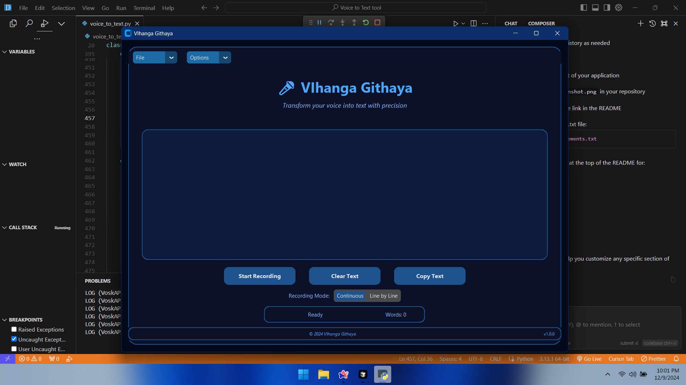

# VIhanga Githaya - Voice to Text Converter

A professional-grade voice-to-text converter application built with Python, featuring real-time transcription capabilities and a modern user interface.

 <!-- You can add a screenshot of your application here -->

## Features

- 🎤 Real-time voice-to-text conversion
- 📝 Two recording modes: Continuous and Line-by-Line
- 💾 Save transcriptions as text files
- 📋 Copy text to clipboard functionality
- 🌓 Light/Dark mode support
- 📊 Word count tracking
- 🎯 Professional UI with customizable themes

## Installation

1. Clone the repository: https://github.com/dazai2003/vihanga-githaya---The-voice-to-text-converter
2. Install required dependencies
3. 
3. Download the Vosk model:
- Create a `model` folder in the project directory
- Download the appropriate model from [Vosk Models](https://alphacephei.com/vosk/models)
- Extract the model files into the `model` folder

## Usage

1. Run the application: python voice_to_text.py
2. Click "Start Recording" to begin voice capture
3. Speak clearly into your microphone
4. Click "Stop Recording" to end the session
5. Save or copy your transcribed text as needed

## Recording Modes

- **Continuous Mode**: Transcribes speech continuously in real-time
- **Line by Line Mode**: Transcribes speech in separate lines with pauses

## Features Guide

- **File Menu**:
  - New: Create a new transcription
  - Open: Load existing text file
  - Save/Save As: Save transcription to file
  - Exit: Close application

- **Options Menu**:
  - Light/Dark Mode: Toggle appearance
  - System Mode: Match system theme
  - About: View application information
  - Help: Access user guide

## System Requirements

- Python 3.x
- Windows/macOS/Linux
- Microphone
- Internet connection (for initial model download)

## Dependencies

- customtkinter
- vosk
- pyaudio
- tkinter

## Building from Source

To create an executable:pyinstaller --onefile --windowed voice_to_text.py

## Version History

- 1.0.0 (2024)
  - Initial release
  - Basic voice-to-text functionality
  - Modern UI implementation
